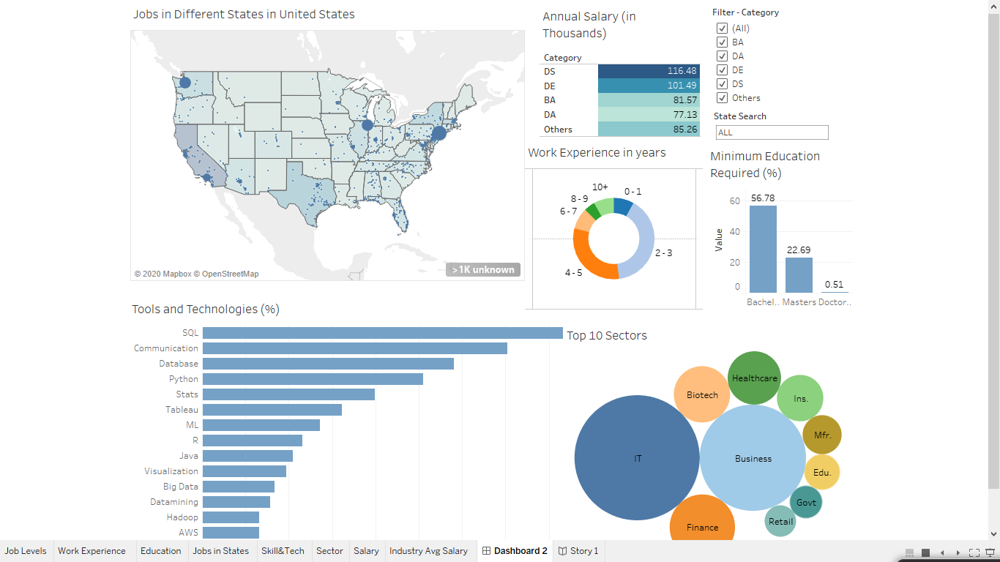
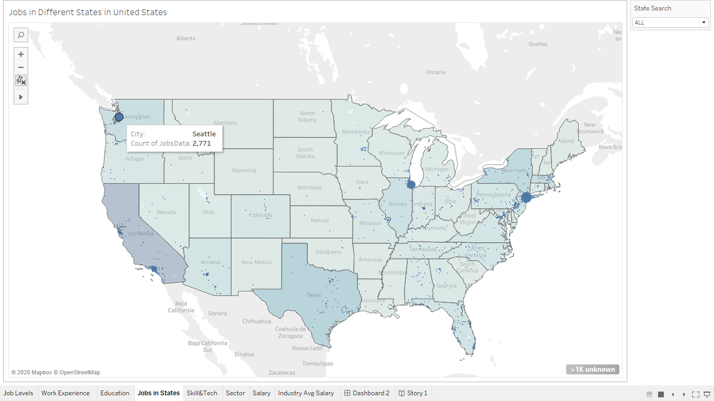
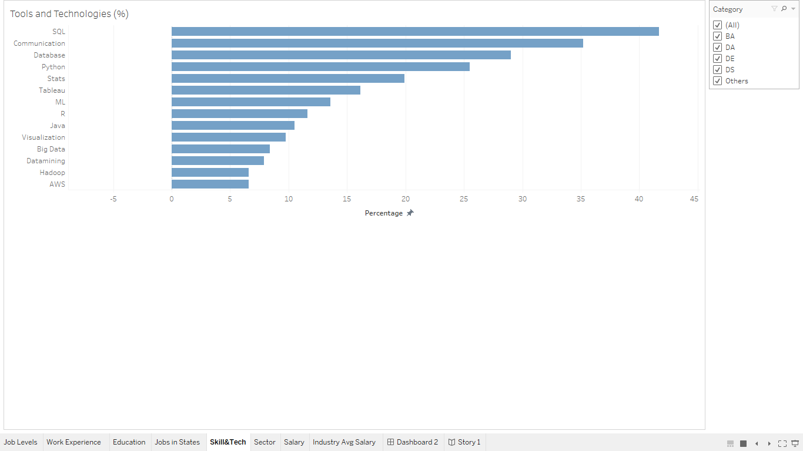
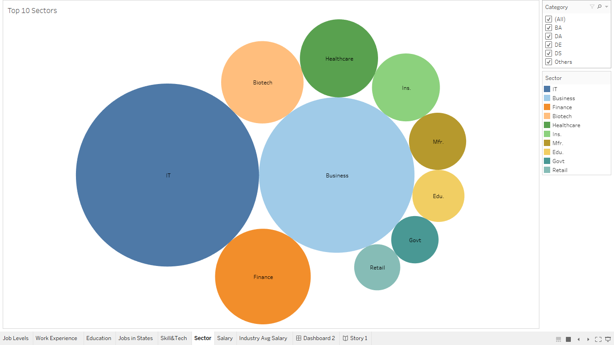
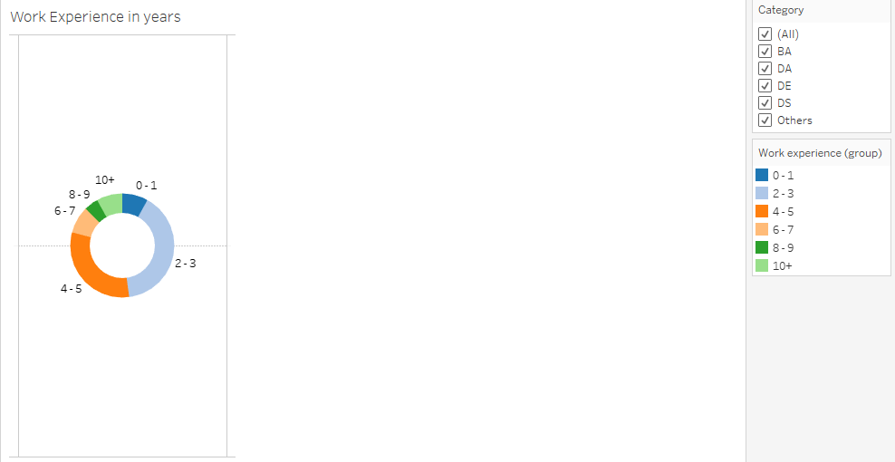
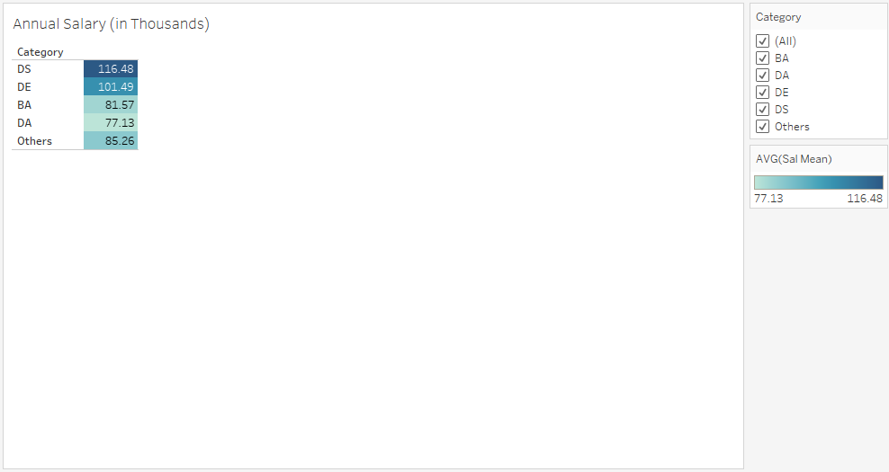
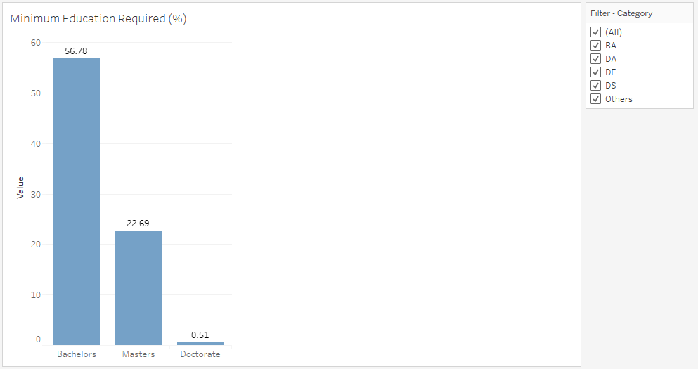

# Dashboard-Visualization-of-Data-Science-Jobs
This project consists of Web-Scraping, Data Wrangling, Feature Extraction, and a Tableau Dashboard visualization to show data science job information in the United States.
The job information visualized in the Dashboard are for Data Scientist, Business Analyst, Data Analyst, and Data Engineer roles. 

### Features
Features such as different states, cities, skills requirements, work experience, Annual Salary, Education Requirement, Various Industry sectors that provide Data Science jobs are visualized.
### Filters
There are filters provided to give user control of the Dashboard where a user can search for a particular state or a city of interest. 

A filter for position is also given if a user is also interested in a particular type of job. For example checking on BA in Filter will give visualizations for only Business Analyst roles. 

Similarly, selecting a state will give information only for that state and change the mean salary as well as skill requirements and work experience requirement for that state/city. 

Here is a glimpse of the Dashboard.

### Hovering over a specific city with search filters for state.

### Skills for jobs selected in the filter on the right.

### Relative comparison of different sectors providing jobs in fields selected on the right.

### Work experience requirement for selected jobs and selected states in filter.

### Mean Salary for Data Science, Data Analyst, Business Analyst, and Data Engineer for states selected.

### Education requirements for selected states and job types.

### Files Information

The Tableau Dashboard file, ready to use data (web scraped and feature extracted), web scraping code, data wrangling and feature extraction code can be found in the repository.
